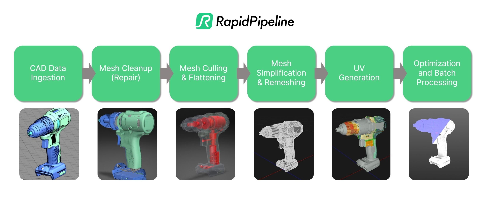

# RapidPipeline-CAD-Data-Preparation-Samples

## Introduction
A collection of CAD Data Preparation &amp; 3D Processing Workflows on publicly available Sample Assets utilizing the [RapidPipeline 3D Processor CLI](https://docs.rapidpipeline.com/docs/componentDocs/3dProcessor/04cliDocumentation/cli-setup-guide) 

## Purpose

The purpose of this repository is to deliver example workflows and assets illustrating what is needed for an optimal conversion from parametric CAD data to tessellated mesh data suitable for CGI and real-time visualization use-cases. In a future update examples for (physics) simulation and other additional use-cases will be added.  

The RapidPipeline 3D Processor Software is utilized as an examplary pipeline tool to automate most of the Data Preparation and 3D Processing tasks and show-case the results of the processing.

*Exemplary CAD Data Preparation & 3D Processing Pipeline Process Flowchart*

## Sample Assets

The sample CAD assets are collected from publicly available data (e.g. from [grabcad.com](https://grabcad.com/library)) and more information as well as the respecitve workflows each asset were utilized for can be found in the respective [sub-directory](./sample-assets/sample-assets-overview.md)

## Processing Samples

The processing samples can be found in the respective [sub-directory](./workflows/workflow-overview.md) and correspond to each identified step in the CAD Dataprep and 3D Processing Pipeline needed to go from a "raw" parametric CAD dataset to CGI and real-time render-ready 3D data set.  
  
Each sample was selected to present one or more challenges during that process. Furthermore the given sample assets were selected to present a wide range of complexity - leaning more towards actual stand-ins for "real-world" CAD data rather than simplified minimalistic samples.  