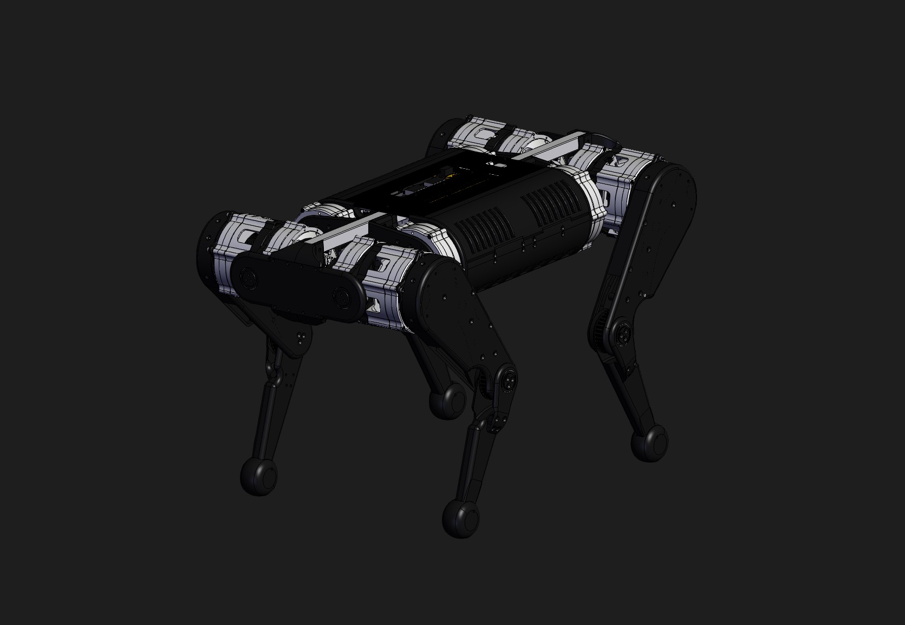
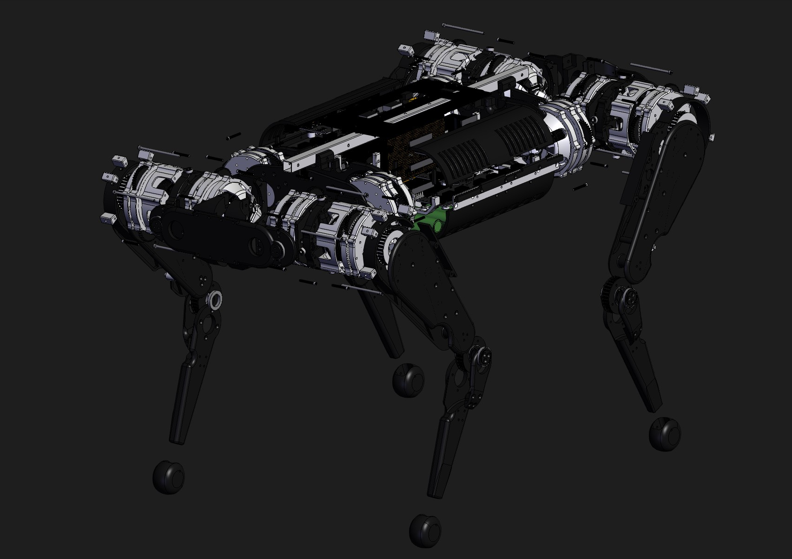

# Cooper CAD refined.step

## Summary

Cooper - Quadruped Robot (robot dog)

## Link

https://grabcad.com/library/cooper-quadruped-robot-robot-dog-1

## Screenshots

  

  

## Description

The finished robot is a compact, high-torque quadruped built around custom actuators using a 9.8:1 3D-printed planetary gearbox, 60 mm brushless motors and integrated magnetic encoders. Each actuator is a rigid module with controlled tolerances, stable bearing support and clean paths for motor leads, encoder wiring and thermistors, making the joints easy to service and monitor.
Each leg consists of two 16 cm links connected by a belt-driven knee, keeping motor mass close to the chassis and ensuring smooth torque transmission. The shoulder joint combines a large radial bearing with a tri-roller side-load system for stable operation under load. The geometry of the links, bearings and pulleys is designed for stiffness, low friction and precise repeatable motion.
The chassis uses aluminium extrusions with ASA/rPLA interface plates that secure the actuators while maintaining access for wiring and maintenance. A printed enclosure with two 30 mm internal fans provides organised cooling for the ODrive controllers and power electronics, and integrated cable channels keep the routing clean and interference-free.
Electrically, the robot runs twelve motors through six ODrive controllers coordinated by a Teensy 4.1, with an Arduino Mega managing thermistor inputs and radio-control data. A dual-battery system, consisting of a 6S traction pack and a 2S logic pack, feeds a staged power board with inrush protection and a mechanical pre-charge key that also serves as an emergency stop. EMI-shielded encoder wiring, MT30 motor connectors and inline protection points ensure robustness during operation.
Overall, the final robot is a stiff, reliable and high-performance quadruped designed for precise locomotion control and future experimental development.

## Purpose

This asset is a good example for a medium complex CAD assembly with a number of intricate and interior parts (screws, bolts, PCBs etc.) as well as some more complex scene hierarchy and dependencies.  

## Author

Vlad Mesa - https://grabcad.com/vlad.mesa-1 

## Legal

[GrabCad Terms](https://grabcad.com/terms)
[GrabCad IP Policy](https://grabcad.com/ip_policy)
