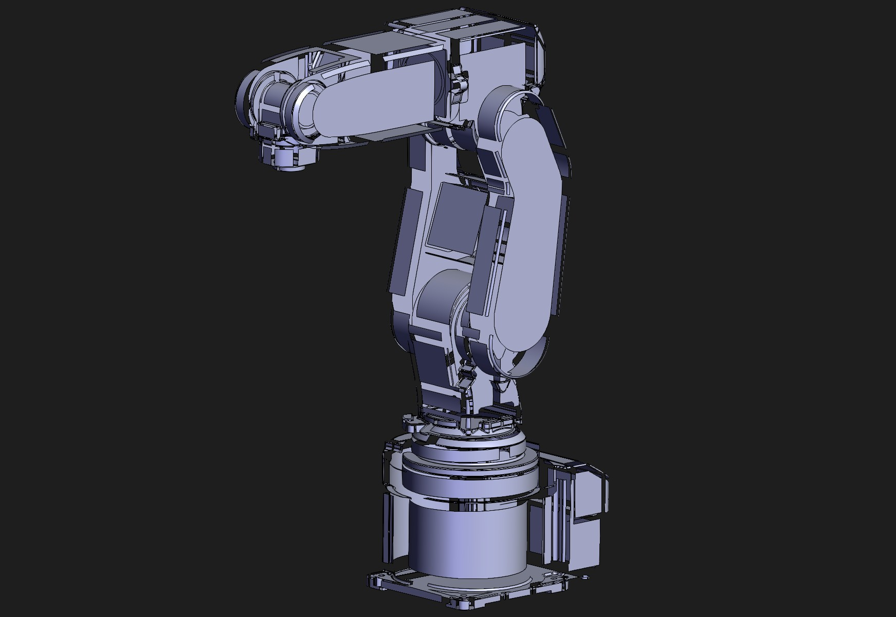

# Robot rv.IGS

## Summary

Mitsubishi RV-2F-D1-S16 6-Axis Robot Arm

## Link

https://grabcad.com/library/mitsubishi-rv-2f-d1-s16-6-axis-robot-arm-1

## Screenshots

  

  

## Description

This is a high-quality 3D model of the Mitsubishi RV-2F-D1-S16, a compact 6-axis industrial robot.
Specifications:
Brand: Mitsubishi Electric
Model: RV-2F-D1-S16
Type: 6-Axis Robot Arm
Axes: 6
Payload Capacity: 3.5 kg
Reach: 504 mm
Repeatability: ±0.02 mm
Mounting: Floor, wall, or ceiling
Weight: Approx. 17 kg (depending on configuration)

## Purpose

This sample CAD asset demonstrates quite a few challenges for a propper conversion from parametric CAD to polygonal mesh:

### Surface Patches

1. The parametric surface was created through patches which are non-solids and allow for the creation of non-planar, complex 3D surfaces. However these patches present quite a large challenge for the tessellation and mesh processing step. Ideally they are already merged  on the b-rep level before any tessellation.  

### Winding Order

2. Winding Order Issues. These usually stem from translation issues from parametric CAD to mesh surface, but can also have their origin within the CAD data set for example due to intersecting surfaces or open edges.  

  

## Author

Mohamed TELDJOUN - https://grabcad.com/mohamed.teldjoun-1 

## Legal

[GrabCad Terms](https://grabcad.com/terms)
[GrabCad IP Policy](https://grabcad.com/ip_policy)