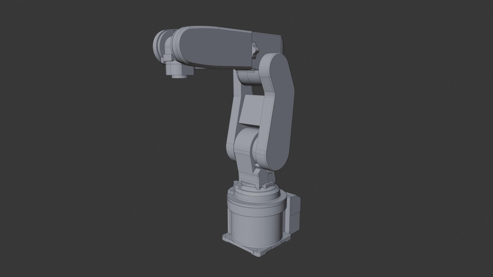

# Robot rv.IGS

## Summary

Mitsubishi RV-2F-D1-S16 6-Axis Robot Arm

## Link

https://grabcad.com/library/mitsubishi-rv-2f-d1-s16-6-axis-robot-arm-1

## Screenshots

## Description

This is a high-quality 3D model of the Mitsubishi RV-2F-D1-S16, a compact 6-axis industrial robot.
Specifications:
Brand: Mitsubishi Electric
Model: RV-2F-D1-S16
Type: 6-Axis Robot Arm
Axes: 6
Payload Capacity: 3.5 kg
Reach: 504 mm
Repeatability: ±0.02 mm
Mounting: Floor, wall, or ceiling
Weight: Approx. 17 kg (depending on configuration)

## Purpose

This sample CAD asset demonstrates ...

## Author

Mohamed TELDJOUN - https://grabcad.com/mohamed.teldjoun-1 

## Legal

[GrabCad Terms](https://grabcad.com/terms)
[GrabCad IP Policy](https://grabcad.com/ip_policy)