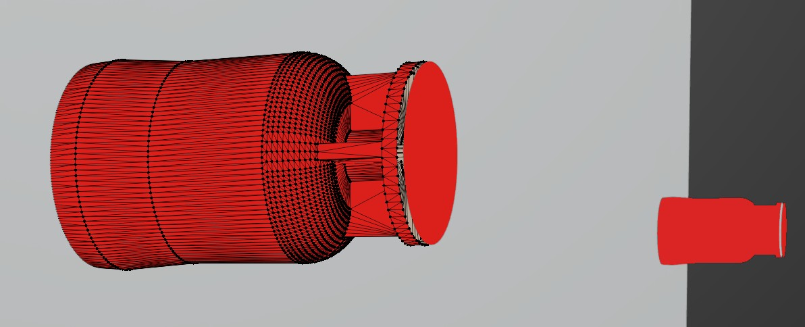
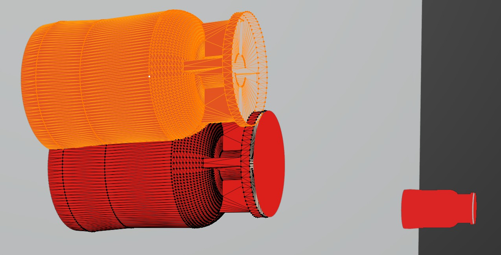

# WRE 45 ASS TOTAL.x_t

## Summary

refrigerator WRE45 Brastemp Gourmand

## Link

https://grabcad.com/library/refrigerator-wre45-1

## Screenshots

  

  

## Description

refrigerator WRE45 Brastemp Gourmand

## Purpose

This complex sample CAD asset with fillets and interior parts demonstrates quite a few challenges for a propper conversion from parametric CAD to polygonal mesh:

### Small & Interior Parts

1. A few hundred interior parts with nested or overlapping parts (e.g. bolts, hinges within other interior parts).  

### Winding Order

2. Winding Order Issues. These usually stem from translation issues from parametric CAD to mesh surface, but can also have their origin within the CAD data set for example due to intersecting surfaces or open edges.  

  

### Duplicated Parts

3. Some parts can be challenging for further processing as they are overlapping (e.g. pins for winding order correction). This usually stems from issues with instancing or duplicated parametric data from the input asset.  

See above for an example. The geometry is arranged as seen in the first screenshot, but moving the mesh a little reveals a second, identical mesh in the same position. Ideally, this duplicate geometry would be removed before further steps like winding order correction. Depending on how nodes and meshes are merged, these two separate meshes could also easily end up as a single mesh, but still duplicate the geometry.  

A robust solution suitable for real world data is not trivial:  
* Only parts of a mesh may be duplicated.
* Multiple meshes might be partial duplicates of each other. Again, potentially only in some parts, but not completely.
* Geometry might be duplicate, but with inverted winding order, e.g. to represent the inside and outside of a flat surface.
* Positions might be duplicated, but other properties (e.g. normals, UVs, materials) might be different.
* As an extended version of the problem, the geometry might not be strictly duplicated, but still show similar issues with triangles lying exactly on top of other triangles, resulting in overlap. Consider e.g. the geometry of labels wrapped around existing geometry without a sufficient offset.

## Author

Gean Hay - https://grabcad.com/gean.hay-3 

## Legal

[GrabCad Terms](https://grabcad.com/terms)
[GrabCad IP Policy](https://grabcad.com/ip_policy)