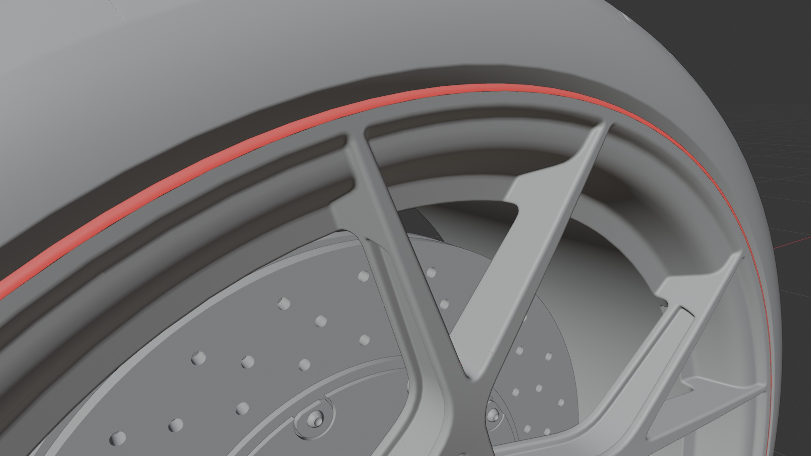
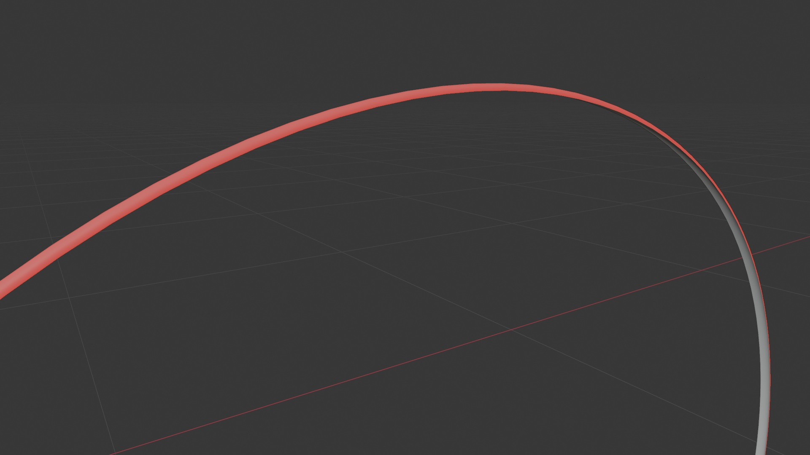
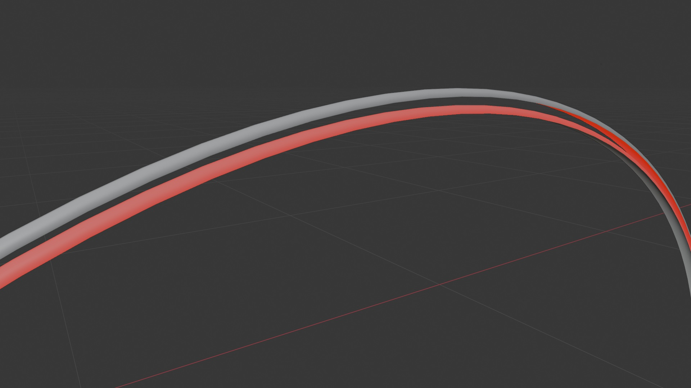

# no.468 gt4rs.stp

## Summary

Porsche 718 Cayman GT4 RS

## Link

https://grabcad.com/library/porsche-718-cayman-gt4-rs-1

## Screenshots

  

  

## Description

Work in Alias2021,rendered in Corona8.
exterior mirror, windshield wiper, brakes,front logo and interior are made by kunos(Assetto Corsa).  

## Purpose

This sample CAD asset demonstrates quite a few challenges for a propper conversion from parametric CAD to polygonal mesh:

### Surface Patches
  
  
1. The parametric surface was created through patches which are non-solids and allow for the creation of non-planar, complex 3D surfaces. However these patches present quite a large challenge for the tessellation and mesh processing step. Ideally they are already merged  on the b-rep level before any tessellation.  

### Winding Order Issues
  
2. Winding Order Issues. These usually stem from translation issues from parametric CAD to mesh surface, but can also have their origin within the CAD data set for example due to intersecting surfaces or open edges.  

### Duplicated Parts

3. Some parts can be challenging for further processing as they are overlapping (e.g. inner ring between rim and tire for winding order correction). This usually stems from issues with instancing or duplicated parametric data from the input asset.  

See above for an example. The geometry is arranged as seen in the first and second screenshot, but moving the mesh a little reveals a second, identical mesh in the same position. Ideally, this duplicate geometry would be removed before further steps like winding order correction. Depending on how nodes and meshes are merged, these two separate meshes could also easily end up as a single mesh, but still duplicate the geometry.  

A robust solution suitable for real world data is not trivial:  
* Only parts of a mesh may be duplicated.
* Multiple meshes might be partial duplicates of each other. Again, potentially only in some parts, but not completely.
* Geometry might be duplicate, but with inverted winding order, e.g. to represent the inside and outside of a flat surface.
* Positions might be duplicated, but other properties (e.g. normals, UVs, materials) might be different.
* As an extended version of the problem, the geometry might not be strictly duplicated, but still show similar issues with triangles lying exactly on top of other triangles, resulting in overlap. Consider e.g. the geometry of labels wrapped around existing geometry without a sufficient offset.

## Author

aria - https://grabcad.com/aria-16 

## Legal

[GrabCad Terms](https://grabcad.com/terms)
[GrabCad IP Policy](https://grabcad.com/ip_policy)