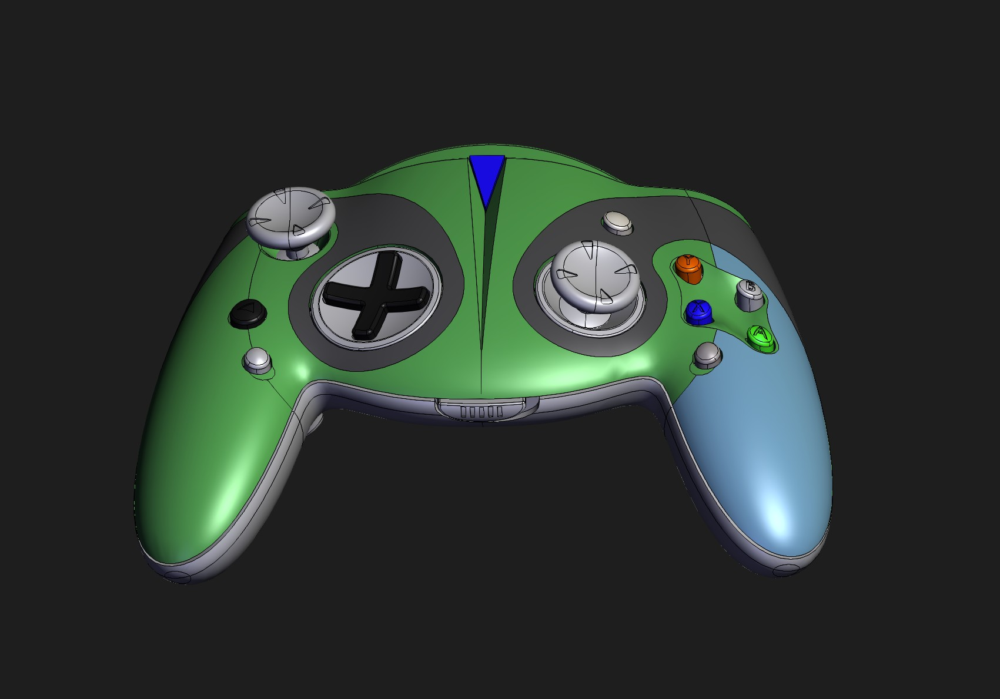
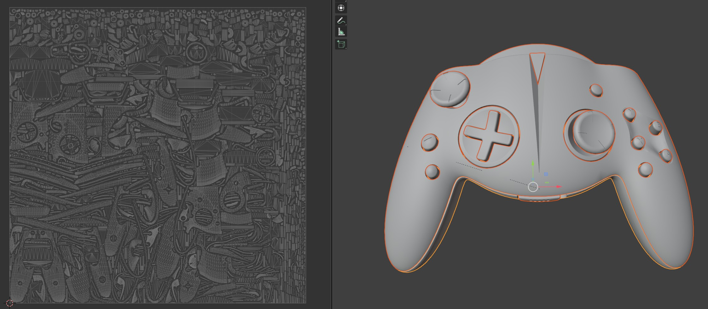
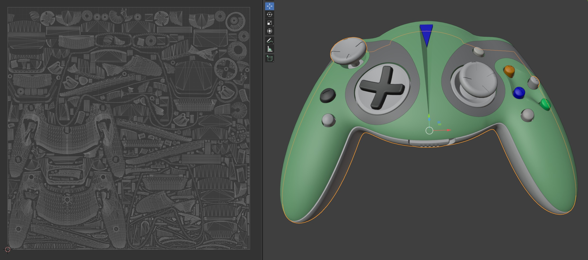

# UV Generation

## Description

This workflow section is about UV Generation. There are multiple ways to generate UVs, each highly depending on the particular use-case:  

1. UV Atlas Generation  
	- Different Methods and Layout (e.g. for hard-surface assets, for organic assets, for authoring workflows vs automated processing etc.)  
	- Additional Techniques and Practises (e.g. UV atlas per material/mesh/node, UV Tiles/UDIMs, arbitrary number of UV atlases - e.g. atlas factor etc.)  
	- Suited for further texturing workflows requiring atlas layouts (e.g. 3D painting etc.) or automated downstream pipelines incl. texture map baking (real-time vizualizations, game-engines, XR, Web etc.)
2. Tiling UVs (e.g. Projection Mapping)  
	- Different Methods (cube, sphere, cylinder, etc.)  
	- Suited for material assignment and texture authoring workflows (tiling textures, procedural materials etc.).  

### Example Files & Results

<br>

The sample results can be found within the [sub-directory here](./sample-results)  

<br>


Game-controller-ASM.STEP - single UV atlas vs UV atlas per material:  

| Input CAD Asset | Processed Output |
|---------|-------------|
| [Game-controller-ASM.STEP](<../../sample-assets/Game-controller-ASM.STEP/README.md>), [Download Link](https://grabcad.com/library/xbox-style-controller)[](<../../sample-assets/Game-controller-ASM.STEP/README.md>) |  |  
<br>


KA ProArt- RTX-4090SO16G v16.step - single UV atlas vs UV atlas per material:  

| Input CAD Asset | Processed Output |
|---------|-------------|
| [KA ProArt- RTX-4090SO16G v16.step](<../../sample-assets/KA ProArt- RTX-4090SO16G v16.step/README.md>), [Download Link](https://grabcad.com/library/proart-rtx-4080so16g-1) [](<../../sample-assets/KA ProArt- RTX-4090SO16G v16.step/README.md>) |  |  
<br>

KA ProArt- RTX-4090SO16G v16.step - Tiling UV Generation (Projection Mapping) - cubeUnwrap (Box Projection):  

| Input CAD Asset | Processed Output |
|---------|-------------|
| [KA ProArt- RTX-4090SO16G v16.step](<../../sample-assets/KA ProArt- RTX-4090SO16G v16.step/README.md>), [Download Link](https://grabcad.com/library/proart-rtx-4080so16g-1) [](<../../sample-assets/KA ProArt- RTX-4090SO16G v16.step/README.md>) |  |  
<br>


## Steps to Reproduce

In order to reproduce the given results please follow the steps below:

### 3D Processor CLI

1. [Install and set-up the RapidPipeline 3D Processor CLI](https://docs.rapidpipeline.com/docs/componentDocs/3dProcessor/04cliDocumentation/cli-setup-guide)  
	- Requires RapidPipeline enterprise plan or free enterprise trial to access the CLI ([Contact here](https://rapidpipeline.com/en/contact/))  
	- Information regarding [latest version and changelog can be found here](https://docs.rapidpipeline.com/3d-processor-updates)  
2. Download the respective example file for this tutorial. You can find the files in the [overview here](../README.md).  
3. Get the respective .json settings configuration file further below and make sure input file as well as .json file are present  
4. Run the command listed below in your favorite commandline (e.g. windows powershell), more about [3D Processor CLI commands here](https://docs.rapidpipeline.com/docs/componentDocs/3dProcessor/04cliDocumentation/cli-setup-guide#commands-guide)  

Further information regarding [UV Generation](https://docs.rapidpipeline.com/docs/componentDocs/3dProcessor/03settingsGuide/3d-processor-3dedit-settings#material-edit--generate-uvs) in the [RapidPipeline Documentation](https://docs.rapidpipeline.com/docs/componentDocs/3dProcessor/3d-processor-overview).  

## Commands

### UV Atlas Generation

#### Single UV Atlas 

```
rpdx --read_config uv-atlas.json -i 'KA ProArt- RTX-4090SO16G v16.step' -r -o output
```

```
rpdx --read_config uv-atlas.json -i 'Game-controller-ASM.STEP' -r -o output
```

Note: Using the [`packedCubeUnwrap`](https://docs.rapidpipeline.com/docs/componentDocs/3dProcessor/03settingsGuide/3d-processor-3dedit-settings#generate-uv-atlas---unwrapping) UV atlas generation method as tessellated CAD assets fall into the hard-surface category of assets.  

#### UV Atlas per Material

```
rpdx --read_config uv-atlas-byMaterial.json -i 'KA ProArt- RTX-4090SO16G v16.step' -r -o output_atlasByMaterial
```

```
rpdx --read_config uv-atlas-byMaterial.json -i 'Game-controller-ASM.STEP' -r -o output_atlasByMaterial
```

#### Multiple UV atlases (atlas factor)

```
rpdx --read_config XXX.json -i '' -r
```

#### UDIMs (UV Tiles)

```
rpdx --read_config XXX.json -i '' -r
```

### Tiling UVs Generation (Projection Mapping)

#### CubeUnwrap

```
rpdx --read_config cubeUnwrap.json -i 'KA ProArt- RTX-4090SO16G v16.step' -r -o output_cubeUnwrap
```

Note: Within the configuration .json settings files in this repository only `usd` output formats are specified. RapidPipeline [supports a lot more file formats](https://docs.rapidpipeline.com/docs/componentDocs/3dProcessor/format-support) which can be [configured within the settings file](https://docs.rapidpipeline.com/docs/componentDocs/3dProcessingSchemaSettings/processor-schema-settings-v1.7#export-slot).  

The 3D Processor CLI will automatically create a default output folder if the run command `-r` is used. In order to define a specific output path the command `-o` can be utilized instead. Read more about [file exports with the CLI here](https://docs.rapidpipeline.com/docs/componentDocs/3dProcessor/04cliDocumentation/cli-setup-guide#export-a-3d-file).  

Alternatively the export command `-e` can be used to generate any output path or file format.  Read more about the [export command here](https://docs.rapidpipeline.com/docs/componentDocs/3dProcessor/04cliDocumentation/cli-setup-guide#export-via-command).  

## Settings File

The settings file is the basis for all processing with the RapidPipeline 3D Processor CLI.  
It is following `.json` syntax and is validated against the [RapidPipeline 3D Processing Schema](https://docs.rapidpipeline.com/docs/componentDocs/3dProcessingSchemaSettings/processor-schema-settings-v1.7).  

In this example we are only making use of the `Import`, `3DEdit`, `Scene Graph Flattening` and `Export` sections (`objects`).  
However, there are a lot more options for 3D processing. More about combining more sections within a single settings .json file in the [Batch Processing workflow](../06_Batch-Processing/README.md).  

<!-- 
## Features & Settings - Main Concepts

Please see below some basic explanation for each feature and setting. Each header also contains a link to the respective sections of the RapidPipeline Documentation:  


### [Mesh Culling](https://docs.rapidpipeline.com/docs/componentDocs/3dProcessor/03settingsGuide/3d-processor-culling-settings)

Various methods of culling geometry from an input model.  

### [Occlusion Culling](https://docs.rapidpipeline.com/docs/componentDocs/3dProcessor/03settingsGuide/3d-processor-culling-settings#occlusion-culling)

Removes occluded (invisible) parts from the 3D model, for the whole 3D model or individually for each mesh.  

-->

## Download or copy the settings file


### UV Atlas Generation

#### Single UV Atlas

[uv-atlas.json](uv-atlas.json)


```
{
    "import": {
      "CAD": {
        "tessellationResolution":"custom", 
        "sewTolerance": 0.05, 
        "removeTJunctions": true,
        "maxSurfaceDeviation": 0.05,
        "maxAngle": 40,
        "maxEdgeLength": 0
      }
    },
  "3dEdit": {
    "materialEdit": {
      "materialReplacer": {
        "defaultMaterial": {
          "generateUVs": {
            "uvAtlasGenerator": {
              "addCheckerTexture": {},
              "method": "packedCubeUVs",
              "segmentationCutAngle": 88.0,
              "segmentationChartAngle": 130.0,
              "maxAngleError": 114.0,
              "maxPrimitivesPerChart": 10000,
              "cutOverlappingPieces": true,
              "atlasMode": "separateAlpha",
              "allowRectangularAtlases": false,
              "packingResolution": 1024,
              "packingPixelDistance": 2
            }
          }
        }
      }
    }
  },
    "export": [
        {
            "discard": {
                "emptyNodes": true, 
                "unusedUVs": false
            }, 
            "fileName": "", 
            "format": {
                "usd": {
                }
            }, 
            "trisToQuads" : {
                "enable" : false
            },
            "optimizeFaceOrder": true, 
            "preserveTextureFilenames": false, 
            "reencodeTextures": "auto", 
            "textureMapFilePrefix": "", 
            "textureNamingScript": ""
        }
  ]
}
```

#### UV Atlas per Material

Note: UV Atlas Generation can be utilized from within the [`3DEdit`](https://docs.rapidpipeline.com/docs/componentDocs/3dProcessingSchemaSettings/processor-schema-settings-v1.8#material-replacer-option-1b-default-material--generate-uv-atlas) or [`Optimize`](https://docs.rapidpipeline.com/docs/componentDocs/3dProcessingSchemaSettings/processor-schema-settings-v1.8#material-regenerator--uv-atlas-generator--texture-baker) objects. Currently within 3D Edit materials are getting replaced, therefore in order to preserve the existing materials and colors the `UV Atlas Generation` section within the `optimize` object is used.  
Note: When utilizing UV Atlas Generation per Material (`separateMaterials`), optionally the `Scene Graph Flattening` with [Flattening Mode `byMaterial`](https://docs.rapidpipeline.com/docs/componentDocs/3dProcessor/03settingsGuide/3d-processor-flattening-settings#flattening-methods) object can be utilized so that both mesh nodes and material nodes are merged by Material.  

[uv-atlas-byMaterial.json](uv-atlas-byMaterial.json)


```
{
    "import": {
      "CAD": {
        "tessellationResolution":"custom", 
        "sewTolerance": 0.05, 
        "removeTJunctions": true,
        "maxSurfaceDeviation": 0.05,
        "maxAngle": 40,
        "maxEdgeLength": 0
      }
    },
  "sceneGraphFlattening": {
    "method": "byMaterial",
    "preservedSceneDepth": 0
  },
  "3dEdit": {
    "modelEdit": {
        "splitMultiMaterialMeshes": true
    }
  },
  "optimize": {
    "3dModelOptimizationMethod": {
      "onlyMaterial": {
          "materialMerger": {
            "materialRegenerator": {
              "uvAtlasGenerator": {
                "textureBaker": {
                  "bakingResolution": {
                    "default": 0
                  }
                },
                "method": "packedCubeUVs",
                "segmentationCutAngle": 88.0,
                "segmentationChartAngle": 130.0,
                "maxAngleError": 114.0,
                "maxPrimitivesPerChart": 10000,
                "cutOverlappingPieces": true,
                "atlasMode": "separateMaterials",
                "allowRectangularAtlases": false,
                "packingResolution": 1024,
                "packingPixelDistance": 2,
                "atlasFactor": 1
             }
           }
         }
      }
    }
  },
    "export": [
        {
            "discard": {
                "emptyNodes": true, 
                "unusedUVs": false
            }, 
            "fileName": "", 
            "format": {
                "usd": {
                }
            }, 
            "trisToQuads" : {
                "enable" : false
            },
            "optimizeFaceOrder": true, 
            "preserveTextureFilenames": false, 
            "reencodeTextures": "auto", 
            "textureMapFilePrefix": "", 
            "textureNamingScript": ""
        }
  ]
}
```

#### Multiple UV atlases (atlas factor)

[uv-atlas-byMaterial.json](uv-atlas-byMaterial.json)


```
{}
```

#### UDIMs (UV Tiles)

[uv-atlas-byMaterial.json](uv-atlas-byMaterial.json)


```
{}
```

### Tiling UV Generation (Projection Mapping)


#### Cube Unwrap (Box Projection)

[cubeUnwrap.json](cubeUnwrap.json)


```
{
    "import": {
      "CAD": {
        "tessellationResolution":"custom", 
        "sewTolerance": 0.05, 
        "removeTJunctions": true,
        "maxSurfaceDeviation": 0.05,
        "maxAngle": 40,
        "maxEdgeLength": 0
      }
    },
  "3dEdit": {
    "meshNormals": {},
    "modelEdit": {},
    "materialEdit": {
      "materialReplacer": {
        "defaultMaterial": {
          "generateUVs": {
            "cubeUnwrap": {
              "addCheckerTexture": {},
              "scale": 10.0,
              "sourceSpace3D": "world"
            }
          }
        }
      }
    }
  },
    "export": [
        {
            "discard": {
                "emptyNodes": true, 
                "unusedUVs": false
            }, 
            "fileName": "", 
            "format": {
                "usd": {
                }
            }, 
            "trisToQuads" : {
                "enable" : false
            },
            "optimizeFaceOrder": true, 
            "preserveTextureFilenames": false, 
            "reencodeTextures": "auto", 
            "textureMapFilePrefix": "", 
            "textureNamingScript": ""
        }
  ]
}
```