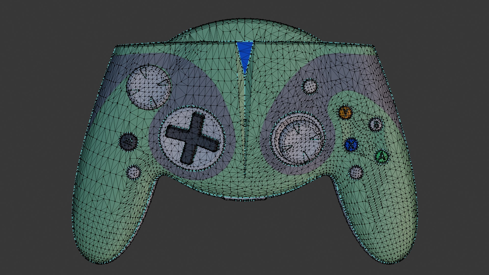
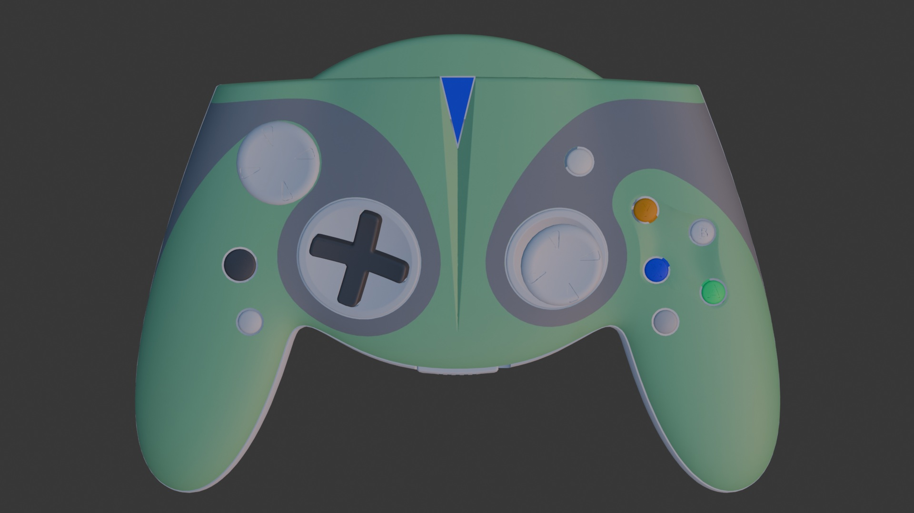
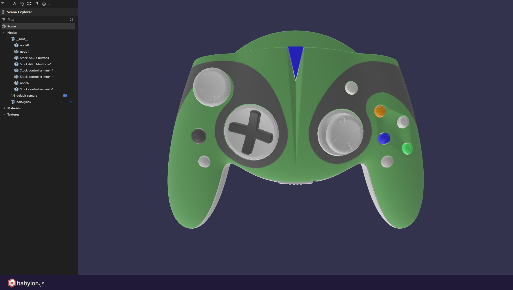

# Optimization

## Description

This workflow section is about optimization options such as full downstream optimization pipelines including Mesh Simplification, UV Generation and Texture Baking as well as more advanced optimization concepts such as mesh deviation, size on screen or file size target.  

Additional features such as mesh and texture compression are also looked at.  

## Example Files & Results

<br>

The sample results can be found within the [sub-directory here](./sample-results)  

<br>

### Remeshing & Texture Baking

Game-controller-ASM.STEP remeshed to 50,000 faces:  

| Input CAD Asset | Processed Output |
|---------|-------------|
| [Game-controller-ASM.STEP](<../../sample-assets/Game-controller-ASM.STEP/README.md>), [Download Link](https://grabcad.com/library/xbox-style-controller)[](<../../sample-assets/Game-controller-ASM.STEP/README.md>) |  |  
<br>

### File Size Target + Remeshing & Texture Baking + Mesh & Texture Compression

Game-controller-ASM.STEP remeshed to 50,000 faces with a target file size of 1.5 MB utilizing additional [Mesh (draco)](https://docs.rapidpipeline.com/docs/componentDocs/3dProcessingSchemaSettings/processor-schema-settings-v1.8#draco-compression-settings) & [Texture Compression (ktx2)](https://docs.rapidpipeline.com/docs/componentDocs/3dProcessingSchemaSettings/processor-schema-settings-v1.8#ktx-compression-settings) algorithms (.glTF output format) - visualized with [babylon.js](https://sandbox.babylonjs.com/):  

| Input CAD Asset | Processed Output |
|---------|-------------|
| [Game-controller-ASM.STEP](<../../sample-assets/Game-controller-ASM.STEP/README.md>), [Download Link](https://grabcad.com/library/xbox-style-controller)[](<../../sample-assets/Game-controller-ASM.STEP/README.md>) |  |  
<br>

### Size on Screen utilizing Decimation & Texture Baking

Cordless Drill DeWalt DCD791_variation01-standard.3dm decimated with baked normal map in 3 different `sizeOnScreen` resolutions (512px, 1024px, 2048px):  

| Input CAD Asset | Processed Output |
|---------|-------------|
| [Cordless Drill DeWalt DCD791_variation01-standard.3dm](<../../sample-assets/Cordless Drill DeWalt DCD791_variation01-standard.3dm/README.md>), [Download](<Cordless Drill DeWalt DCD791_variation01-standard.3dm/asset/Cordless Drill DeWalt DCD791_variation01-standard.3dm>)[](<../../sample-assets/Cordless Drill DeWalt DCD791_variation01-standard.3dm/README.md>) |  |  

Cordless Drill DeWalt DCD791_variation01-standard.3dm - size on screen values and how they correspond/steer output mesh and texture resolution:

| Size on Screen | Triangles Count | Texture Resolution |
|---------|-------------|-------------|
| 512 | Triangles Count | 2048 x 2048 |
| 1024 | Triangles Count | 4096 x 4096 |
| 2048 | Triangles Count | 8192 x 8192 |
<br>


## Steps to Reproduce

In order to reproduce the given results please follow the steps below:

### 3D Processor CLI

1. [Install and set-up the RapidPipeline 3D Processor CLI](https://docs.rapidpipeline.com/docs/componentDocs/3dProcessor/04cliDocumentation/cli-setup-guide)  
	- Requires RapidPipeline enterprise plan or free enterprise trial to access the CLI ([Contact here](https://rapidpipeline.com/en/contact/))  
	- Information regarding [latest version and changelog can be found here](https://docs.rapidpipeline.com/3d-processor-updates)  
2. Download the respective example file for this tutorial. You can find the files in the [overview here](../README.md).  
3. Get the respective .json settings configuration file further below and make sure input file as well as .json file are present  
4. Run the command listed below in your favorite commandline (e.g. windows powershell), more about [3D Processor CLI commands here](https://docs.rapidpipeline.com/docs/componentDocs/3dProcessor/04cliDocumentation/cli-setup-guide#commands-guide)  

Further information regarding [Optimization](https://docs.rapidpipeline.com/docs/componentDocs/3dProcessor/03settingsGuide/3d-processor-optimize-settings) in the [RapidPipeline Documentation](https://docs.rapidpipeline.com/docs/componentDocs/3dProcessor/3d-processor-overview).  

## Commands

### Remeshing & Texture Baking

```
rpdx --read_config optimize_remesh-bake.json -i 'Game-controller-ASM.STEP' -r -o output
```

### File Size Target + Remeshing & Texture Baking + Mesh & Texture Compression

```
rpdx --read_config optimize_remesh-bake_fileSize.json -i 'Game-controller-ASM.STEP' -r -o output_file-size
```

### Size on Screen utilizing Decimation & Texture Baking

```
rpdx --read_config size-on-screen-512.json --read_c rotateZUp.json -i 'Cordless Drill DeWalt DCD791_variation01-standard.3dm' -r -o output_sizeOnScreen/512
```

```
rpdx --read_config size-on-screen-1024.json --read_c rotateZUp.json -i 'Cordless Drill DeWalt DCD791_variation01-standard.3dm' -r -o output_sizeOnScreen/1024
```

```
rpdx --read_config size-on-screen-2048.json --read_c rotateZUp.json -i 'Cordless Drill DeWalt DCD791_variation01-standard.3dm' -r -o output_sizeOnScreen/2048
```

Note: Within the configuration .json settings files in this repository only `usd` output formats are specified. RapidPipeline [supports a lot more file formats](https://docs.rapidpipeline.com/docs/componentDocs/3dProcessor/format-support) which can be [configured within the settings file](https://docs.rapidpipeline.com/docs/componentDocs/3dProcessingSchemaSettings/processor-schema-settings-v1.7#export-slot).  

The 3D Processor CLI will automatically create a default output folder if the run command `-r` is used. In order to define a specific output path the command `-o` can be utilized instead. Read more about [file exports with the CLI here](https://docs.rapidpipeline.com/docs/componentDocs/3dProcessor/04cliDocumentation/cli-setup-guide#export-a-3d-file).  

Alternatively the export command `-e` can be used to generate any output path or file format.  Read more about the [export command here](https://docs.rapidpipeline.com/docs/componentDocs/3dProcessor/04cliDocumentation/cli-setup-guide#export-via-command).  

## Settings File

The settings file is the basis for all processing with the RapidPipeline 3D Processor CLI.  
It is following `.json` syntax and is validated against the [RapidPipeline 3D Processing Schema](https://docs.rapidpipeline.com/docs/componentDocs/3dProcessingSchemaSettings/processor-schema-settings-v1.7).  

In this example we are only making use of the `Import`, `Optimize`, `Modifier`, `Scene Graph Flattening` and `Export` sections (`objects`).  
However, there are a lot more options for 3D processing. More about combining more sections within a single settings .json file in the [Batch Processing workflow](../06_Batch-Processing/README.md).  


## Features & Settings - Main Concepts

Please see below some basic explanation for each feature and setting. Each header also contains a link to the respective sections of the RapidPipeline Documentation:  


Note: See information regarding `decimation` and `remeshing` within the previous workflow [03_Mesh-Simplification-Remeshing](../03_Mesh-Simplification-Remeshing/README.md)


### [Texture Baker](https://docs.rapidpipeline.com/docs/componentDocs/3dProcessingSchemaSettings/processor-schema-settings-v1.8#texture-baker)

The general texture baking options which bakes all supported PBR material properties.  

#### [Normal Map Baker](https://docs.rapidpipeline.com/docs/componentDocs/3dProcessingSchemaSettings/processor-schema-settings-v1.8#normal-map-baker)

This `object` steers the normal map baking process.  

#### [AO Baker](https://docs.rapidpipeline.com/docs/componentDocs/3dProcessingSchemaSettings/processor-schema-settings-v1.8#ambient-occlusion-map-baker)

This optional baker steers the generation of ambient occlusion texture maps. Turns AO (Ambient Occlusion) generation on/off.  

### [File Size Target](https://docs.rapidpipeline.com/docs/componentDocs/3dProcessor/03settingsGuide/3d-processor-modifier-settings#file-size-target)

Modifier which alters the optimization settings in order to meet a given maximum file size (MB).  

### [Size on Screen](https://docs.rapidpipeline.com/docs/componentDocs/3dProcessor/03settingsGuide/3d-processor-modifier-settings#size-on-screen-target)

Calculates optimal mesh and texture resolution for a given display size on screen in pixel. Default is 0 (=off).  

It utilizes mesh deviation and a pixel per unit metric in order to calculate the optimal mesh and texture resolution for a given display size on screen in pixels. The pixel target is limited to one value, which is used for width and height of the given size on screen.  

This method is optional and can work standalone or in conjunction with other targets.  
  
### Compression  

#### [Draco Mesh Compression](https://docs.rapidpipeline.com/docs/componentDocs/3dProcessor/03settingsGuide/3d-processor-export-settings#draco-compression-settings)

Draco mesh compression for exported 3D data. Requires`.glTF`/`.glb` formats.  

#### [KTX Texture Compression](https://docs.rapidpipeline.com/docs/componentDocs/3dProcessor/03settingsGuide/3d-processor-export-settings#texture-format)

KTX texture compression for exported textures.  

Written out with all [supported 3D formats](https://docs.rapidpipeline.com/docs/componentDocs/3dProcessor/format-support#feature-support-by-3d-format), however most real-time viewers and environments support `ktx` compression with `.glTF`/`.glb` formats.  


## Download or copy the settings file

### Remeshing & Texture Baking

[optimize_remesh-bake.json](optimize_remesh-bake.json)

```
{
    "import": {
      "CAD": {
        "tessellationResolution":"custom", 
        "sewTolerance": 0.01, 
        "removeTJunctions": true,
        "maxSurfaceDeviation": 0.05,
        "maxAngle": 40,
        "maxEdgeLength": 0
      }
    },
  "sceneGraphFlattening": {
    "method": "byMaterial",
    "preservedSceneDepth": 0
  },
  "optimize": {
    "3dModelOptimizationMethod": {
      "meshAndMaterialOptimization": {
        "remesher": {
          "target": {
            "faces": {
              "value": 50000
            }
          },
          "materialMerger": {
            "materialRegenerator": {
              "uvAtlasGenerator": {
                "textureBaker": {
                  "normalMap": {
                    "mode": "always",
                    "recomputeNormals": true
                  },
                  "aoBaker": {
                    "strength": 0.5,
                    "replaceOriginal": true,
                    "filterRadius": 3.0,
                    "textureSamples": 48
                  },
                  "bakingResolution": {
                    "default": 4096
                  },
                  "texMapAutoScaling": true
                },
                "atlasMode": "separateAlpha",
                "atlasFactor": 1
              }
            }
          },
          "method": "shrinkwrap",
          "resolution": 11,
          "filterBackProjected": true
        }
      }
    }
  },
    "export": [
        {
            "discard": {
                "emptyNodes": true, 
                "unusedUVs": false
            }, 
            "fileName": "", 
            "format": {
                "usd": {
                }
            }, 
            "trisToQuads" : {
                "enable" : false
            },
            "optimizeFaceOrder": true, 
            "preserveTextureFilenames": false, 
            "reencodeTextures": "auto", 
            "textureMapFilePrefix": "", 
            "textureNamingScript": ""
        }
  ]
}
```

### File Size Target + Remeshing & Texture Baking + Mesh & Texture Compression

[optimize_remesh-bake_fileSize.json](optimize_remesh-bake_fileSize.json)

```
{
    "import": {
      "CAD": {
        "tessellationResolution":"custom", 
        "sewTolerance": 0.01, 
        "removeTJunctions": true,
        "maxSurfaceDeviation": 0.05,
        "maxAngle": 40,
        "maxEdgeLength": 0
      }
    },
  "sceneGraphFlattening": {
    "method": "byMaterial",
    "preservedSceneDepth": 0
  },
  "optimize": {
    "3dModelOptimizationMethod": {
      "meshAndMaterialOptimization": {
        "remesher": {
          "target": {
            "faces": {
              "value": 50000
            }
          },
          "materialMerger": {
            "materialRegenerator": {
              "uvAtlasGenerator": {
                "textureBaker": {
                  "normalMap": {
                    "mode": "always",
                    "recomputeNormals": true
                  },
                  "bakingResolution": {
                    "default": 4096
                  },
                  "texMapAutoScaling": true
                },
                "atlasMode": "separateAlpha",
                "atlasFactor": 1
              }
            }
          },
          "method": "shrinkwrap",
          "resolution": 11,
          "filterBackProjected": true
        }
      }
    }
  },
  "modifier": {
    "filesize": {
      "maxMegabytesOnDisk": 1.5
    }
  },
    "export": [
    {
      "fileName": "",
      "preserveTextureFilenames": false,
      "textureMapFilePrefix": "",
      "reencodeTextures": "auto",
      "discard": {
        "unusedUVs": false,
        "emptyNodes": true
      },
      "format": {
        "gltf": {
          "pbrMaterial": {
            "maxTextureResolution": {
              "default": 16384
            },
            "textureFormat": {
              "default": "ktx-basis-etc1s",
              "normal": "ktx-basis-uastc"
            },
            "textureCompression": {
              "jpeg": {
                "quality": 90,
                "qualityNormals": 95
              },
              "webp": {
                "quality": 95,
                "qualityNormals": 95
              },
              "ktx": {
                "compressionSpeed": 2,
                "quality": 128,
                "uastcQuality": "default",
                "mipmapCount": 2
              }
            },
            "separateOcclusionMap": false,
            "excludePbrExtensions": false,
            "forceDoubleSidedMaterials": false,
            "forceUnlitMaterials": false,
            "convertMetalRoughness": false
          },
          "geometryCompression": "dracoLossy",
          "excludeTangents": true,
          "draco": {
            "positionQuantization": 14,
            "normalQuantization": 10,
            "uvQuantization": 12,
            "boneWeightsQuantization": 12
          }
        }
      }
    }
  ]
}
```

### Size on Screen utilizing Decimation & Texture Baking

#### 512 px

[size-on-screen-512.json](size-on-screen-512.json)

```
{
    "import": {
      "CAD": {
        "tessellationResolution":"extraFine", 
        "sewTolerance": 0.01, 
        "removeTJunctions": true,
        "maxSurfaceDeviation": 0.05,
        "maxAngle": 40,
        "maxEdgeLength": 0
      }
    },
  "sceneGraphFlattening": {
    "method": "byMaterial",
    "preservedSceneDepth": 0
  },
  "optimize": {
    "3dModelOptimizationMethod": {
      "meshAndMaterialOptimization": {
        "decimator": {
          "target": {
            "faces": {
              "value": 10000000
            },
            "deviation": {
              "percentage": 0
            }
          },
          "materialOptimization": {
          "materialMerger": {
            "materialRegenerator": {
              "uvAtlasGenerator": {
                "textureBaker": {
                  "normalMap": {}
                }
              }
            }
           }
          },
          "preserveTopology": false,
          "preserveNormals": false,
          "preserveMeshBorders": true,
          "preserveMaterialBorders": false,
          "collapseUnconnectedVertices": true,
          "boundaryPreservationFactor": 0.50,
          "collapseDistanceThreshold": 0.005,
          "method": "quadric"
        }
      }
    }
  },
  "modifier": {
    "screensize": {
      "pixelTarget": 512.0
    }
  },
    "export": [
        {
            "discard": {
                "emptyNodes": true, 
                "unusedUVs": false
            }, 
            "fileName": "", 
            "format": {
                "usd": {
                }
            }, 
            "trisToQuads" : {
                "enable" : false
            },
            "optimizeFaceOrder": true, 
            "preserveTextureFilenames": false, 
            "reencodeTextures": "auto", 
            "textureMapFilePrefix": "", 
            "textureNamingScript": ""
        }
  ]
}
```

#### 1024 px

[size-on-screen-1024.json](size-on-screen-1024.json)

```
[...]
  "modifier": {
    "screensize": {
      "pixelTarget": 1024.0
    }
  },
[...]
```

#### 2048 px

[size-on-screen-2048.json](size-on-screen-2048.json)

```
[...]
  "modifier": {
    "screensize": {
      "pixelTarget": 2048.0
    }
  },
[...]
```


