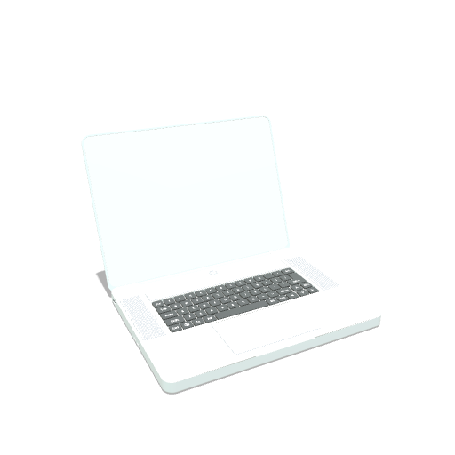
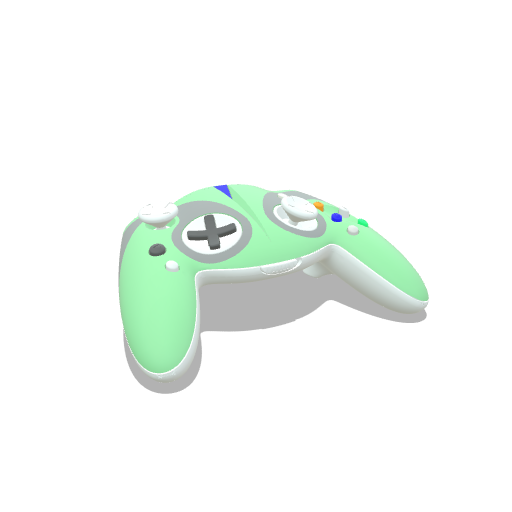

# Batch Processing

## Description

This last workflow section looks at the batch processing aspects of a CAD dataprep pipeline.  

### Example Files & Results

<br>

The sample results can be found within the [sub-directory here](./sample-results)  

<br>


All previous sample models and results after processing through universal CAD data preparation configuration and batch setup:  

| Input CAD Asset | Processed Output | Output Data Statistics |
|---------|-------------|-------------|
| [28L Storage Box - Assembly.x_t](<../../sample-assets/28L Storage Box - Assembly.x_t/README.md>)<br>[](<../../sample-assets/28L Storage Box - Assembly.x_t/README.md>) |  | [stats](<./sample-results/output/CAD-dataprep/28L Storage Box - Assembly_web/28L Storage Box - Assembly_output.json>) |
| [ASSEMBLING_notebook.STEP](<../../sample-assets/ASSEMBLING_notebook.STEP/README.md>)<br>[](<../../sample-assets/ASSEMBLING_notebook.STEP/README.md>) |  | [stats](<./sample-results/output/CAD-dataprep/ASSEMBLING_notebook_web/ASSEMBLING_notebook_output.json>) |
| [Cell Phone Cover.STEP](<../../sample-assets/Cell Phone Cover.STEP/README.md>)<br>[](<../../sample-assets/Cell Phone Cover.STEP/README.md>) |  | [stats](<./sample-results/output/CAD-dataprep/Cell Phone Cover_web/Cell Phone Cover_output.json>) |
| [Cooper CAD refined.step](<../../sample-assets/Cooper CAD refined.step/README.md>)<br>[](<../../sample-assets/Cooper CAD refined.step/README.md>) |  | [stats](<./sample-results/output/CAD-dataprep/Cooper CAD refined_web/Cooper CAD refined_output.json>) |
| [Cordless Drill DeWalt DCD791_variation01-standard.3dm](<../../sample-assets/Cordless Drill DeWalt DCD791_variation01-standard.3dm/README.md>)<br>[](<../../sample-assets/Cordless Drill DeWalt DCD791_variation01-standard.3dm/README.md>) |  | [stats](<./sample-results/output/CAD-dataprep/Cordless Drill DeWalt DCD791_variation01-standard_web/Cordless Drill DeWalt DCD791_variation01-standard_output.json>) |
| [EG 43-17 HG Pojemnik.STEP](<../../sample-assets/EG 43-17 HG Pojemnik.STEP/README.md>)<br>[](<../../sample-assets/EG 43-17 HG Pojemnik.STEP/README.md>) |  | [stats](<./sample-results/output/CAD-dataprep/EG 43-17 HG Pojemnik_web/EG 43-17 HG Pojemnik_output.json>) |
| [Game-controller-ASM.STEP](<../../sample-assets/Game-controller-ASM.STEP/README.md>)<br>[](<../../sample-assets/Game-controller-ASM.STEP/README.md>) |  | [stats](<./sample-results/output/CAD-dataprep/Game-controller-ASM_web/Game-controller-ASM_output.json>) |
| [KA ProArt- RTX-4090SO16G v16.step](<../../sample-assets/KA ProArt- RTX-4090SO16G v16.step/README.md>)<br>[](<../../sample-assets/KA ProArt- RTX-4090SO16G v16.step/README.md>) |  | [stats](<./sample-results/output/CAD-dataprep/KA ProArt- RTX-4090SO16G v16_web/KA ProArt- RTX-4090SO16G v16_output.json>) |
| [no.468 gt4rs.stp](<../../sample-assets/no.468 gt4rs.stp/README.md>)<br>[](<../../sample-assets/no.468 gt4rs.stp/README.md>) |  | [stats](<./sample-results/output/CAD-dataprep/no.468 gt4rs_web/no.468 gt4rs_output.json>) |
| [Robot rv.IGS](<../../sample-assets/Robot rv.IGS/README.md>)<br>[](<../../sample-assets/Robot rv.IGS/README.md>) |  | [stats](<./sample-results/output/CAD-dataprep/Robot rv_web/Robot rv_output.json>) |
| [WRE 45 ASS TOTAL.x_t](<../../sample-assets/WRE 45 ASS TOTAL.x_t/README.md>)<br>[](<../../sample-assets/WRE 45 ASS TOTAL.x_t/README.md>) |  | [stats](<./sample-results/output/CAD-dataprep/WRE 45 ASS TOTAL_web/WRE 45 ASS TOTAL_output.json>) |

## Steps to Reproduce

The python based batch script and setup instructions are available on the DGG Githib page: https://github.com/DGG3D/cli-batching-simple.  
The script essentially utilizes the RapidPipeline 3D Processor CLI to batch over an input folder structure and can deal with an arbitrary number of input files. It also stores processing and input vs output file metadata (processing metrics, file statistics) as well as thumbnails via PBR rendering.  
Information about all supported 3D and CAD file formats as well as supported 3D features is provided within [the RapidPipeline Documentation](https://docs.rapidpipeline.com/docs/componentDocs/3dProcessor/format-support#feature-support-by-3d-format).

### Set-up python batch script and batch processing environment

1. Get the script here: https://github.com/DGG3D/cli-batching-simple.
2. Copy over all the relevant sample data into the `input` folder and delete the existing sample data.
3. Create another folder next to `input` named `input-Z-Up` - then move the following sample assets into that subfolder:
	- [Cell Phone Cover.STEP](<../../sample-assets/Cell Phone Cover.STEP/README.md>)
	- [Cordless Drill DeWalt DCD791_variation01-standard.3dm](<../../sample-assets/Cordless Drill DeWalt DCD791_variation01-standard.3dm/README.md>)
	- [no.468 gt4rs.stp](<../../sample-assets/no.468 gt4rs.stp/README.md>)
4. Copy over the configuration settings file into `configurations` folder and delete the existing `test_0.json` configuration. 
5. Make sure python is installed and execute the commands seen [further below](#commands). Alternatively store and execute the commands from a `.bat` file (if on windows).

The batch processing environment (folder structure) should now look like this:

```
cli-batching-simple-main
	- configurations/CAD-dataprep.json|CAD-dataprep-Z-Up.json
	- input/...
	- input-Z-Up/...
	- ./optimize.py
	- ./RUN.bat (optional)
```

once the processing runs the following additional data will be created:

```
cli-batching-simple-main
	- _errors
	- render.json
	- output/...
```

### 3D Processor CLI

1. [Install and set-up the RapidPipeline 3D Processor CLI](https://docs.rapidpipeline.com/docs/componentDocs/3dProcessor/04cliDocumentation/cli-setup-guide)  
	- Requires RapidPipeline enterprise plan or free enterprise trial to access the CLI ([Contact here](https://rapidpipeline.com/en/contact/))  
	- Information regarding [latest version and changelog can be found here](https://docs.rapidpipeline.com/3d-processor-updates)  
2. Download the respective example file for this tutorial. You can find the files in the [overview here](../README.md).  
3. Get the respective .json settings configuration file further below and make sure input file as well as .json file are present  
4. Run the command listed below in your favorite commandline (e.g. windows powershell), more about [3D Processor CLI commands here](https://docs.rapidpipeline.com/docs/componentDocs/3dProcessor/04cliDocumentation/cli-setup-guide#commands-guide)  


## Commands

```
python optimize.py -i input -c configurations/CAD-dataprep.json -o output/CAD-dataprep
```

```
python optimize.py -i input-Z-Up -c configurations/CAD-dataprep-Z-Up.json -o output/CAD-dataprep
```

Note: On windows the python command can also be stored within a `.bat` file. That way also multiple different python command executions can be chained and executed one after the other.

## Settings File

### CAD Dataprep

[CAD-dataprep.json](CAD-dataprep.json)

```
{
    "import": {
      "CAD": {
        "tessellationResolution":"custom", 
        "sewTolerance": 0.05, 
        "removeTJunctions": true,
        "maxSurfaceDeviation": 0.05,
        "maxAngle": 40,
        "maxEdgeLength": 0
      },
    "general": {
      "rotateZUp": false
      }
    },
  "3dEdit": {
    "meshNormals": {
      "recomputeInputNormals": true,
      "hardAngleThreshold": 30.0,
      "computationMethod": "area"
    },
    "modelEdit": {
        "splitMultiMaterialMeshes": true
    },
    "repair": {
      "windingOrder": {
        "visibilityMode": "default",
        "ignoreTransparency" : false,
        "perLump": true
      }
    }
  },
  "sceneGraphFlattening": {
    "method": "byMaterial",
    "preservedSceneDepth": 1
  },
  "meshCulling": {
    "occlusionCulling": {
      "perMesh": false,
      "quality": "default",
      "ignoreTransparency": false,
      "diffusion": "conservative",
      "runAfterDecimator": false,
      "sampleEdges": true,
      "perLumpDecision" : true,
      "lumpThreshold": 0.1
    },
    "smallFeatureCulling": {
      "sizeThreshold": {
        "percentage": 0.01
      },
      "runAfterDecimator": false
    }
  },
    "optimize": {
        "3dModelOptimizationMethod": {
            "meshAndMaterialOptimization": {
                "decimator": {
                    "materialOptimization": {
                      "materialMerger": {
                        "materialRegenerator": {
                          "uvAtlasGenerator": {
                            "textureBaker": {
                              "bakingResolution": {
                                "default": 0
                              },
                              "sampleCount": 4,
                              "texMapAutoScaling": true,
                              "bakeCombinedScene": false,
                              "topologicalHolesToAlpha": false,
                              "powerOfTwoResolution": "ceil",
                              "inpaintingRadius": 32.0
                            },
                            "method": "packedCubeUVs",
                            "segmentationCutAngle": 88.0,
                            "segmentationChartAngle": 130.0,
                            "maxAngleError": 114.0,
                            "maxPrimitivesPerChart": 10000,
                            "cutOverlappingPieces": true,
                            "atlasMode": "separateMaterials",
                            "allowRectangularAtlases": false,
                            "packingResolution": 1024,
                            "packingPixelDistance": 2,
                            "atlasFactor": 1
                         }
                       }
                     }
                    },
                    "target": {
                        "faces": {
                            "value": 500000
                        },
                        "deviation": {
                            "percentage": 0.005
                        }
                    },
                    "preserveNormals": true,
                    "preserveTopology": false
                }
            }
        }
    },
    "export": [
        {
            "discard": {
                "emptyNodes": true, 
                "unusedUVs": false
            }, 
            "fileName": "", 
            "format": {
                "usd": {
                }
            }, 
            "trisToQuads" : {
                "enable" : false
            },
            "optimizeFaceOrder": true, 
            "preserveTextureFilenames": false, 
            "reencodeTextures": "auto", 
            "textureMapFilePrefix": "", 
            "textureNamingScript": ""
        }
  ]
}
```

### CAD Dataprep Rotate Z-Up

[CAD-dataprep-Z-Up.json](CAD-dataprep-Z-Up.json)

```
{
    "import": {
      "CAD": {
        "tessellationResolution":"custom", 
        "sewTolerance": 0.05, 
        "removeTJunctions": true,
        "maxSurfaceDeviation": 0.05,
        "maxAngle": 40,
        "maxEdgeLength": 0
      },
    "general": {
      "rotateZUp": true
      }
    },
  "3dEdit": {
    "meshNormals": {
      "recomputeInputNormals": true,
      "hardAngleThreshold": 30.0,
      "computationMethod": "area"
    },
    "modelEdit": {
        "splitMultiMaterialMeshes": true
    },
    "repair": {
      "windingOrder": {
        "visibilityMode": "default",
        "ignoreTransparency" : false,
        "perLump": true
      }
    }
  },
  "sceneGraphFlattening": {
    "method": "byMaterial",
    "preservedSceneDepth": 1
  },
  "meshCulling": {
    "occlusionCulling": {
      "perMesh": false,
      "quality": "default",
      "ignoreTransparency": false,
      "diffusion": "conservative",
      "runAfterDecimator": false,
      "sampleEdges": true,
      "perLumpDecision" : true,
      "lumpThreshold": 0.1
    },
    "smallFeatureCulling": {
      "sizeThreshold": {
        "percentage": 0.01
      },
      "runAfterDecimator": false
    }
  },
    "optimize": {
        "3dModelOptimizationMethod": {
            "meshAndMaterialOptimization": {
                "decimator": {
                    "materialOptimization": {
                      "materialMerger": {
                        "materialRegenerator": {
                          "uvAtlasGenerator": {
                            "textureBaker": {
                              "bakingResolution": {
                                "default": 0
                              },
                              "sampleCount": 4,
                              "texMapAutoScaling": true,
                              "bakeCombinedScene": false,
                              "topologicalHolesToAlpha": false,
                              "powerOfTwoResolution": "ceil",
                              "inpaintingRadius": 32.0
                            },
                            "method": "packedCubeUVs",
                            "segmentationCutAngle": 88.0,
                            "segmentationChartAngle": 130.0,
                            "maxAngleError": 114.0,
                            "maxPrimitivesPerChart": 10000,
                            "cutOverlappingPieces": true,
                            "atlasMode": "separateMaterials",
                            "allowRectangularAtlases": false,
                            "packingResolution": 1024,
                            "packingPixelDistance": 2,
                            "atlasFactor": 1
                         }
                       }
                     }
                    },
                    "target": {
                        "faces": {
                            "value": 500000
                        },
                        "deviation": {
                            "percentage": 0.005
                        }
                    },
                    "preserveNormals": true,
                    "preserveTopology": false
                }
            }
        }
    },
    "export": [
        {
            "discard": {
                "emptyNodes": true, 
                "unusedUVs": false
            }, 
            "fileName": "", 
            "format": {
                "usd": {
                }
            }, 
            "trisToQuads" : {
                "enable" : false
            },
            "optimizeFaceOrder": true, 
            "preserveTextureFilenames": false, 
            "reencodeTextures": "auto", 
            "textureMapFilePrefix": "", 
            "textureNamingScript": ""
        }
  ]
}
```
