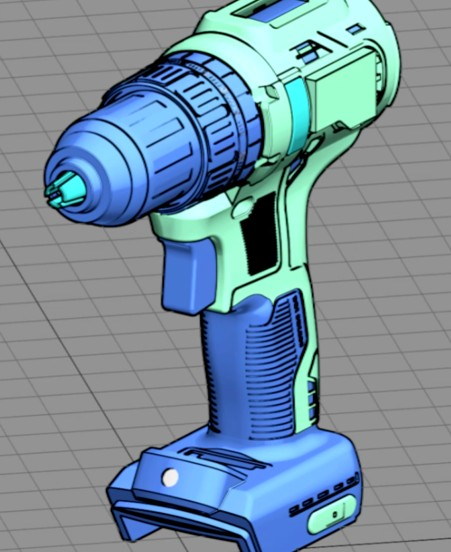
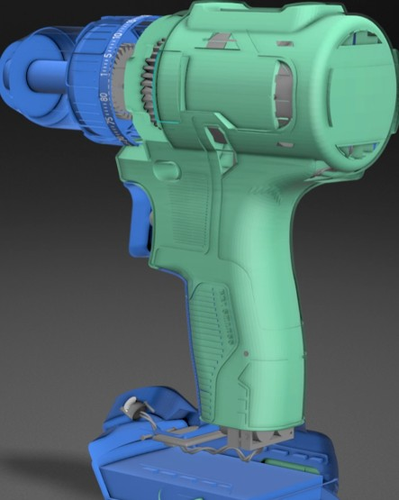
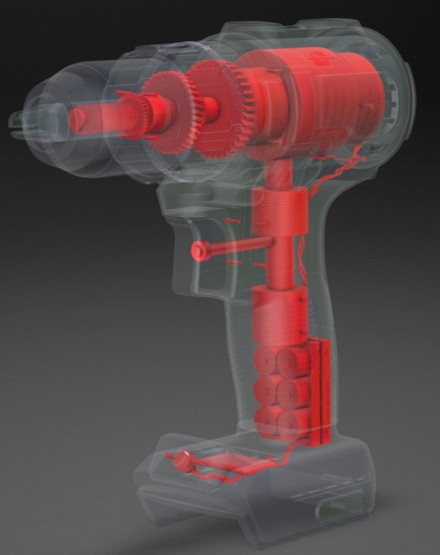
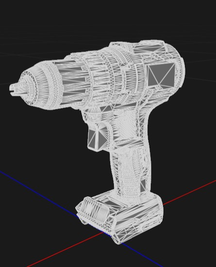
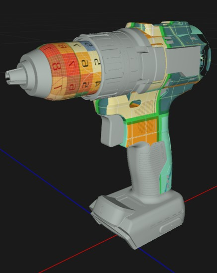
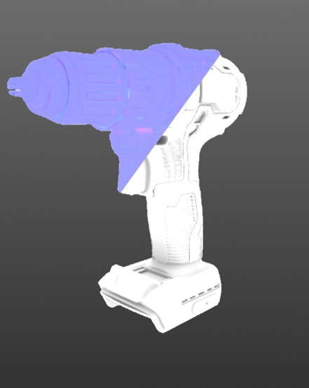
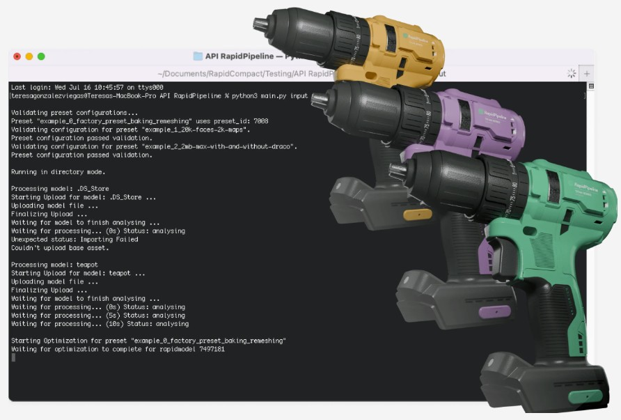

# Processing Workflows

## Overview

| Workflow | Short Description | Purpose | Utilized Sample Asset(s) | Software |
|---------|-------------|-------------|-------------|-------------|
| [CAD Data Ingestion](./00_CAD-Data-Ingestion/README.md)  | Short Description | Purpose | [EG 43-17 HG Pojemnik.STEP](<EG 43-17 HG Pojemnik.STEP/README.md>), [no.468 gt4rs.stp](<../sample-assets/no.468 gt4rs.stp/README.md>) | [RapidPipeline 3D Processor CLI](https://docs.rapidpipeline.com/docs/componentDocs/3dProcessor/04cliDocumentation/cli-setup-guide) |
| [Mesh Cleanup](./01_Mesh-Cleanup/README.md)  | Short Description | Purpose | [28L Storage Box - Assembly.x_t](<../sample-assets/28L Storage Box - Assembly.x_t/README.md>), [Cordless Drill DeWalt DCD791_variation01-standard.3dm](<../sample-assets/Cordless Drill DeWalt DCD791_variation01-standard.3dm/README.md>), [Robot rv.IGS](<../sample-assets/Robot rv.IGS/README.md>) | [RapidPipeline 3D Processor CLI](https://docs.rapidpipeline.com/docs/componentDocs/3dProcessor/04cliDocumentation/cli-setup-guide) |
| [3D Operations (Culling, Flattening)](./02_3D-Operations/README.md)  | Short Description | Purpose | [ASSEMBLING_notebook.STEP](<../sample-assets/ASSEMBLING_notebook.STEP/README.md>), [WRE 45 ASS TOTAL.x_t](<../sample-assets/WRE 45 ASS TOTAL.x_t/README.md>) | [RapidPipeline 3D Processor CLI](https://docs.rapidpipeline.com/docs/componentDocs/3dProcessor/04cliDocumentation/cli-setup-guide) |
| [Mesh Simplification & Remeshing](./03_Mesh-Simplification-Remeshing/README.md)  | Short Description | Purpose | [BOX W HINGES 302020 - TEST.stp](<../sample-assets/BOX W HINGES 302020 - TEST.stp/README.md>), [Cooper CAD refined.step](<../sample-assets/Cooper CAD refined.step/README.md>), [no.468 gt4rs.stp](<../sample-assets/no.468 gt4rs.stp/README.md>) | [RapidPipeline 3D Processor CLI](https://docs.rapidpipeline.com/docs/componentDocs/3dProcessor/04cliDocumentation/cli-setup-guide) |
| [UV Generation](./04_UV-Generation/README.md)  | Short Description | Purpose | [Cooper CAD refined.step](<../sample-assets/Cooper CAD refined.step/README.md>), [KA ProArt- RTX-4090SO16G v16.step](<../sample-assets/KA ProArt- RTX-4090SO16G v16.step/README.md>) | [RapidPipeline 3D Processor CLI](https://docs.rapidpipeline.com/docs/componentDocs/3dProcessor/04cliDocumentation/cli-setup-guide) |
| [Optimization](./05_Optimization/README.md)  | Short Description | Purpose | [Cordless Drill DeWalt DCD791_variation01-standard.3dm](<../sample-assets/Cordless Drill DeWalt DCD791_variation01-standard.3dm/README.md>), [KA ProArt- RTX-4090SO16G v16.step](<../sample-assets/KA ProArt- RTX-4090SO16G v16.step/README.md>) | [RapidPipeline 3D Processor CLI](https://docs.rapidpipeline.com/docs/componentDocs/3dProcessor/04cliDocumentation/cli-setup-guide) |
| [Batch Processing](./06_Batch-Processing/README.md)  | Short Description | Purpose | [Sample Assets](../README.md) | [RapidPipeline 3D Processor CLI](https://docs.rapidpipeline.com/docs/componentDocs/3dProcessor/04cliDocumentation/cli-setup-guide) |